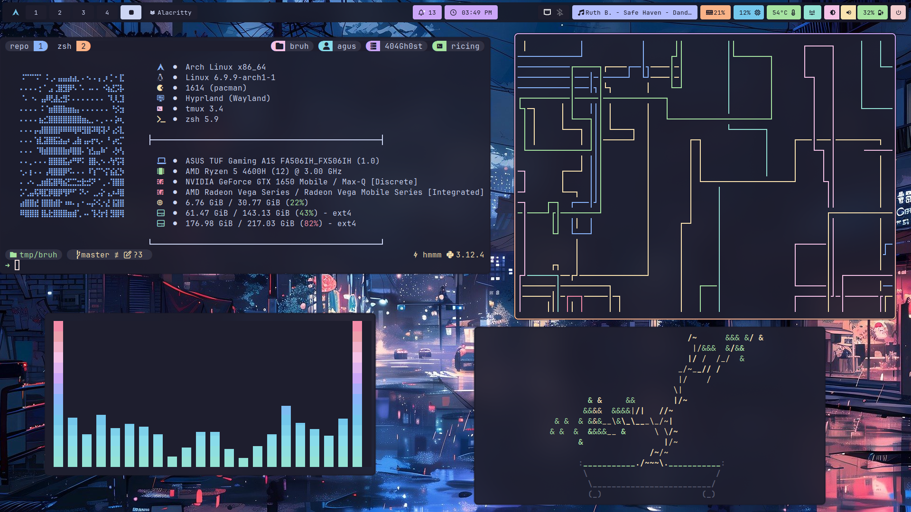
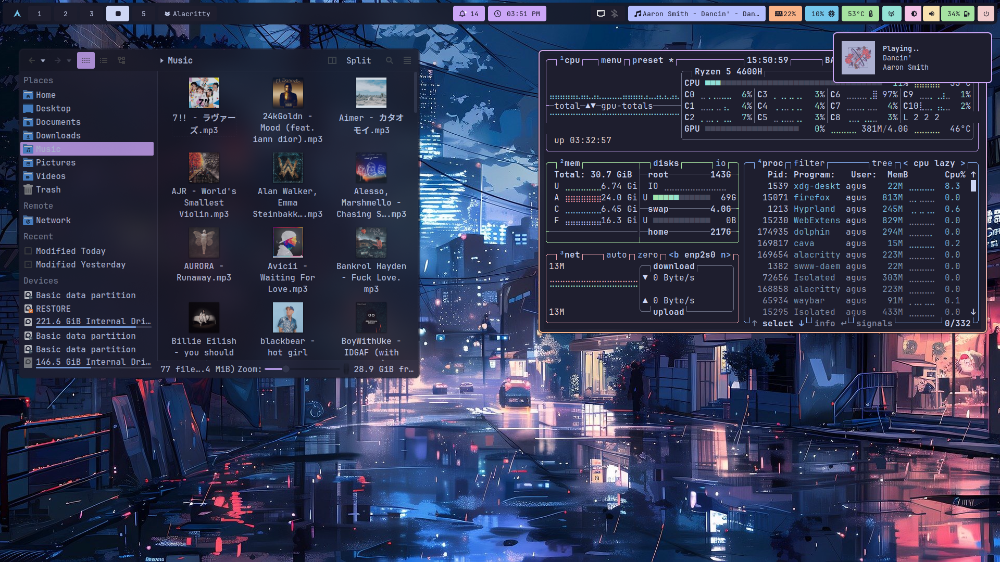

<div align="center">
    <h1> Hyprland dotfiles </h1>
</div>

## 📦 Programs
| Component         | Program    |
|-------------------|------------|
| Windows Manager 🪟| [hyprland](https://github.com/hyprwm/Hyprland)  |
| Terminal 🖥️       | [alacritty](https://github.com/alacritty/alacritty)        |
| Shell 🐚          | [zsh](https://github.com/zsh-users/zsh) / [theme](https://github.com/JanDeDobbeleer/oh-my-posh) |
| Fetch 🖼️          | [fastfetch](https://github.com/fastfetch-cli/fastfetch) |
| File Manager 📁   | [dolphin](https://github.com/KDE/dolphin)      |
| Editor 📝         | [neovim](https://github.com/neovim/neovim) / [my-nvchad-configuration](https://github.com/404GH0ST/my-nvchad-configuration)     |
| Browser 🌐        | [firefox](https://github.com/topics/firefox-browser) / [Firefox-UI-Fix](https://github.com/black7375/Firefox-UI-Fix)|
| Bar 📊            | [waybar](https://github.com/Alexays/Waybar)      |
| Launcher 🚀       | [rofi](https://github.com/davatorium/rofi)          |
| Color Theme 🎨    | [catppuccin](https://github.com/catppuccin/catppuccin) |
| Lockscreen 🔒     | [hyprlock](https://github.com/hyprwm/hyprlock)  |
| Login Menu 🚪     | [sddm](https://github.com/sddm/sddm)          |
| Music Player 🎵   | [ncmpcpp](https://github.com/ncmpcpp/ncmpcpp)      |
| Visualiser 📊     | [cava](https://github.com/karlstav/cava)          |
| Others 🌱         | [cbonsai](https://github.com/mhzawadi/homebrew-cbonsai), [pipes-rs](https://github.com/lhvy/pipes-rs) |

## 📸 Preview





## 💾 Installation 
The installer only works for **ARCH** Linux, and based distros.

<b>Open a terminal in HOME</b>
- **First download the installer**
```sh
curl https://raw.githubusercontent.com/404GH0ST/dotfiles/master/RiceInstaller -o $HOME/RiceInstaller
```
- **Now give it execute permissions**
```sh
chmod +x RiceInstaller
```
- **Finally run the installer**
```sh
./RiceInstaller
```

## 📝 Credits
Some of the configurations are taken from these sources as base configurations:
- [dotfiles](https://github.com/sameemul-haque/dotfiles)
- [hyprdots](https://github.com/prasanthrangan/hyprdots)
- [dotfiles](https://github.com/gh0stzk/dotfiles)
- [dotfiles](https://github.com/m4xshen/dotfiles)
